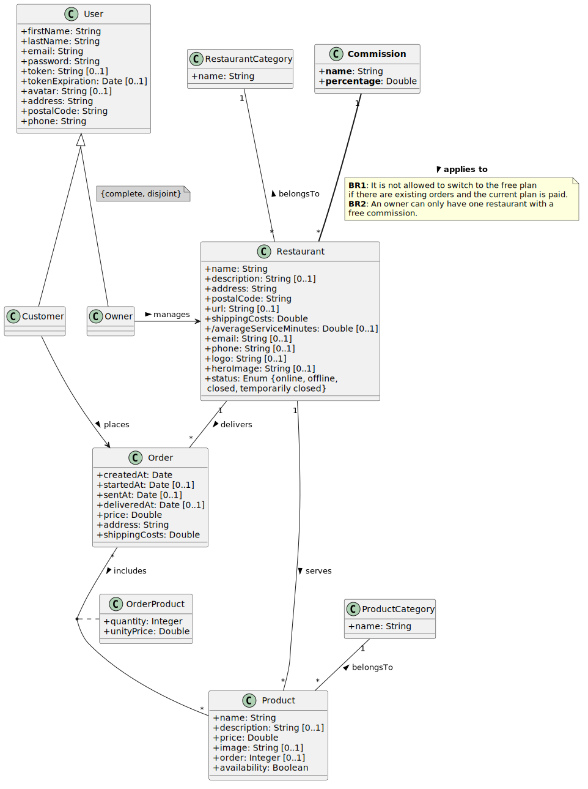

# DeliverUS Exam - Model F - Restaurant Commissions Management

Remember that DeliverUS is described at: <https://github.com/IISSI2-IS>

## Exam Statement

It has been decided to implement a **Commissions on Orders** system for the restaurants on the platform. Each restaurant will have an associated commission that will be applied to the price of its orders.



### Business Requirement

1.  **Commission Types**: There will be different commission types (`Commission` entity). Initially, we will have two:
    -   **Free**: Applies a **0%** commission.
    -   **Paid (Standard)**: Applies a **10%** commission.
2.  **Free Restriction**: An owner can only have **at most one restaurant** associated with the free commission. The free commission will always exist and maintain its restriction.
3.  **Switching to Free Restriction**: If a restaurant already has orders and does not belong to the free plan, it cannot be switched to that plan.
4.  **Commission Calculation**: The system must allow querying the accumulated commission of a restaurant by summing the corresponding part of each order (order price * commission percentage / 100).

The implementation of the following functional requirements is necessary:

### **FR1. Commissions Management**
**As an** owner, 

**I want to** assign a type of commission to my restaurants 

**in order to** control service costs, knowing that I can only have one restaurant with a free commission.

**Acceptance Tests:**
- BR1: If a restaurant has orders and its current commission is not the free one, it cannot be changed to the free commission. The system must return a `409 Conflict` error.
- BR2: If an owner tries to set a second restaurant with a free commission, the system must return a `409 Conflict` error.
- When creating or editing a restaurant, the `commissionId` property is included in the request body.


### **FR2. Accumulated Commission Query**
**As an** owner,

**I want to** query the accumulated commission of my restaurant

**in order to** know the total service costs.

**Acceptance Tests:**
- The system must return the sum of all commissions from the restaurant's orders.
- The commission for each order is calculated as `price * percentage / 100`.
- The result must be presented in JSON format: `{ "totalCommission": X.XX }`.

---

## Exercises

### 1. Migrations and Models (2.5 points)
Create or modify the necessary migrations to implement the requirements, as well as create or modify the necessary models as specified in the conceptual model.

Respect the entity and property names from the conceptual model so that the seeders (`src/database/seeders/20210630120000-commissions-seeder.js` and `src/database/seeders/20210630120001-restaurants-seeder.js`) and tests (`src/tests/restaurantCommissions.test.js`) work correctly.

### 2. Free Commission Check 
If an attempt is made to assign the free commission (0%) to a restaurant, the system must check the described restrictions. The validation of the `commissionId` field is already incorporated in `src/controllers/validation/RestaurantValidation.js`.

#### 2.1. BR1 Check (2 points)
You are provided with the signature of the `checkNoOrdersWhenSwitchingToFree` function in the `src/middlewares/RestaurantMiddleware.js` file.

You are also provided with the helper function `isFreeCommission` in the `src/middlewares/RestaurantMiddleware.js` file that checks if a commission ID corresponds to the free commission.

#### 2.2. BR2 Check (2 points)
You are provided with the signature of the `checkFreeCommissionLimitDuringCreation` and `checkFreeCommissionLimitDuringUpdate` functions in the `src/middlewares/RestaurantMiddleware.js` file.

Remember that you can use the helper function `isFreeCommission` in the `src/middlewares/RestaurantMiddleware.js` file.

### 3. Accumulated Commission Query (3.5 points)
Implement the `GET /restaurants/:restaurantId/commission` endpoint.
This endpoint must return a JSON object with the total sum of the commissions of all the orders placed in that restaurant:
`{ "totalCommission": 125.50 }`


---
## Submission Procedure

1. Delete the backend **node_modules** folder.
1. Create a ZIP that includes the entire project. **Important: Verify that the ZIP is not the same one you downloaded and includes your solution**
1. Notify the teacher before submitting.
1. When the teacher gives you the go-ahead, you can upload the ZIP to the Virtual Teaching platform. **It is very important to wait for the platform to show you a link to the ZIP before pressing the submit button**. It is recommended to download that ZIP to check what has been uploaded. Once the check is done, you can submit the exam.

## Environment Setup

### a) Windows

* Open a terminal and run the command `npm run install:all:win`.

### b) Linux/MacOS

* Open a terminal and run the command `npm run install:all:bash`.

## Execution

### 1. Backend

* To **remake the migrations and seeders**, open a terminal and run the command

    ```Bash
    npm run migrate:backend
    ```

* To **run it**, open a terminal and run the command

    ```Bash
    npm run start:backend
    ```

## Debugging

* To **debug the backend**, make sure there is **NO** running instance, click the `Run and Debug` button on the sidebar, select `Debug Backend` in the dropdown list, and press the *Play* button.


## Test

* As an aid, you can run the included test suite `restaurantCommissions.test.js`. A specific seeder for these tests `20260319121000-restaurant-commissions-seeder.js` is also included, and the `20210630120001-restaurants-seeder.js` seeder has been modified. To do this, run the following command:

    ```Bash
    npm run test:backend
    ```

**Warning: Tests cannot be modified.**