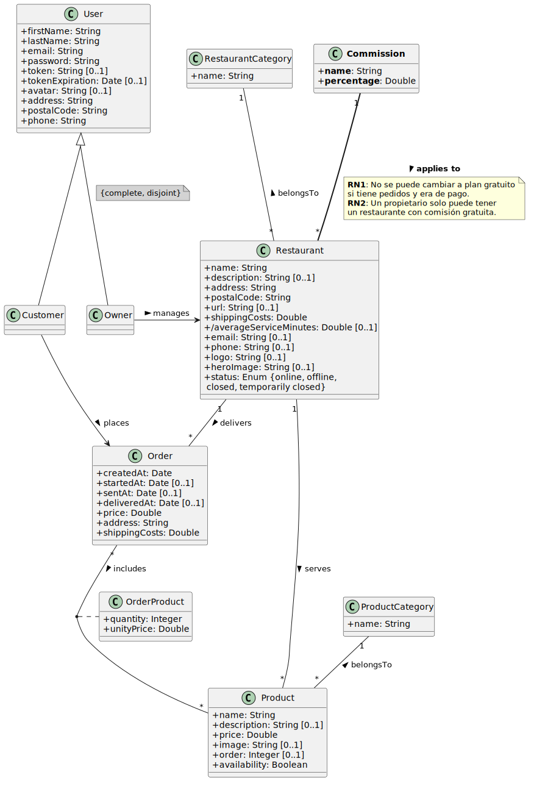

# Examen DeliverUS - Modelo F - Gestión de Comisiones de Restaurantes

Recuerde que DeliverUS está descrito en: <https://github.com/IISSI2-IS>

## Enunciado del examen

Se ha decidido implementar un sistema de **Comisiones sobre Pedidos** para los restaurantes de la plataforma. Cada restaurante tendrá asociada una comisión que se aplicará sobre el precio de sus pedidos.



### El Requisito de Negocio

1.  **Tipos de Comisión**: Existirán diferentes tipos de comisión (entidad `Commission`). Inicialmente tendremos dos:
    -   **Gratuita**: Aplica un **0%** de comisión.
    -   **De Pago (Estándar)**: Aplica un **10%** de comisión.
2.  **Restricción de Gratuidad**: Un propietario (owner) sólo puede tener **como máximo un restaurante** asociado a la comisión gratuita. La comisión gratuita siempre existirá y mantendrá su restricción.
3.  **Restricción de Cambio a Gratuito**: Si un restaurante ya tiene pedidos y no pertenece al plan gratuito, no se le puede cambiar a dicho plan.
4.  **Cálculo de Comisiones**: El sistema debe permitir consultar la comisión acumulada de un restaurante, sumando la parte correspondiente de cada pedido (precio del pedido * porcentaje de comisión / 100).

Es necesaria la implementación de los siguientes requisitos funcionales:

### **RF1. Gestión de Comisiones**
**Como** propietario, 

**quiero** asignar un tipo de comisión a mis restaurantes 

**para** controlar los costes del servicio, sabiendo que sólo puedo tener un restaurante con comisión gratuita.

**Pruebas de aceptación:**
- RN1: Si un restaurante tiene pedidos y su comisión actual no es la gratuita, no se puede cambiar a la comisión gratuita. El sistema debe devolver un error `409 Conflict`.
- RN2: Si un propietario intenta establecer un segundo restaurante con comisión gratuita, el sistema debe devolver un error `409 Conflict`.
- Al crear o editar un restaurante se incluye la propiedad `commissionId` en el cuerpo de la petición.


### **RF2. Consulta de Comisión Acumulada**
**Como** propietario,

**quiero** consultar la comisión acumulada de mi restaurante

**para** conocer los costes totales del servicio.

**Pruebas de aceptación:**
- El sistema debe devolver la suma de todas las comisiones de los pedidos del restaurante.
- La comisión de cada pedido se calcula como `precio * porcentaje / 100`.
- El resultado debe presentarse en formato JSON: `{ "totalCommission": X.XX }`.

---

## Ejercicios

### 1. Migraciones y Modelos (2,5 puntos)
Cree o modifique las migraciones necesarias para implementar los requisitos, así como cree o modifique los modelos necesarios tal y como se especifica en el modelo conceptual.

Respete los nombres de entidades y propiedades del modelo conceptual para que los seeders (`src/database/seeders/20210630120000-commissions-seeder.js` y `src/database/seeders/20210630120001-restaurants-seeder.js`) y tests (`src/tests/restaurantCommissions.test.js`) funcionen correctamente.

### 2. Comprobación de Comisión Gratuita 
Si se intenta asignar la comisión gratuita (0%) a un restaurante, el sistema debe comprobar las restricciones descritas. La validación del campo `commissionId` ya está incorporada en `src/controllers/validation/RestaurantValidation.js`.

#### 2.1. Comprobación de RN1 (2 puntos)
Se le proporciona la signatura de la función `checkNoOrdersWhenSwitchingToFree` en el fichero `src/middlewares/RestaurantMiddleware.js`.

También se le proporciona la función auxiliar `isFreeCommission`  en el fichero `src/middlewares/RestaurantMiddleware.js` que comprueba si un id de comisión corresponde con la comisión gratuita.

#### 2.2. Comprobación de RN2 (2 puntos)
Se le proporciona la signatura de las funciones `checkFreeCommissionLimitDuringCreation` y `checkFreeCommissionLimitDuringUpdate` en el fichero `src/middlewares/RestaurantMiddleware.js`.

Recuerde que puede usar la función auxiliar `isFreeCommission` en el fichero `src/middlewares/RestaurantMiddleware.js`.

### 3. Consulta de Comisión Acumulada (3,5 puntos)
Implemente el endpoint `GET /restaurants/:restaurantId/commission`.
Este endpoint debe devolver un objeto JSON con la suma total de las comisiones de todos los pedidos realizados en ese restaurante:
`{ "totalCommission": 125.50 }`


---
## Procedimiento de entrega

1. Borrar la carpeta **node_modules** de backend.
1. Crear un ZIP que incluya todo el proyecto. **Importante: Comprueba que el ZIP no es el mismo que te has descargado e incluye tu solución**
1. Avisa al profesor antes de entregar.
1. Cuando el profesor te dé el visto bueno, puedes subir el ZIP a la plataforma de Enseñanza Virtual. **Es muy importante esperar a que la plataforma te muestre un enlace al ZIP antes de pulsar el botón de enviar**. Se recomienda descargar ese ZIP para comprobar lo que se ha subido. Un vez realizada la comprobación, puedes enviar el examen.

## Preparación del entorno

### a) Windows

* Abra un terminal y ejecute el comando `npm run install:all:win`.

### b) Linux/MacOS

* Abra un terminal y ejecute el comando `npm run install:all:bash`.

## Ejecución

### 1. Backend

* Para **rehacer las migraciones y seeders**, abra un terminal y ejecute el comando

    ```Bash
    npm run migrate:backend
    ```

* Para **ejecutarlo**, abra un terminal y ejecute el comando

    ```Bash
    npm run start:backend
    ```

## Depuración

* Para **depurar el backend**, asegúrese de que **NO** existe una instancia en ejecución, pulse en el botón `Run and Debug` de la barra lateral, seleccione `Debug Backend` en la lista desplegable, y pulse el botón de *Play*.


## Test

* Como ayuda puede ejecutar el conjunto de tests incluido `restaurantCommissions.test.js`. También se incluye un seeder específico para estas pruebas  `20260319121000-restaurant-commissions-seeder.js` y modificado el seeder de `20210630120001-restaurants-seeder.js`. Para ello ejecute el siguiente comando:

    ```Bash
    npm run test:backend
    ```

**Advertencia: Los tests no pueden ser modificados.**